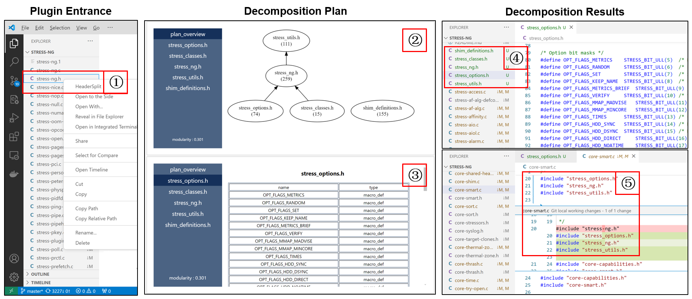

# HeaderSplit: An Automated Tool for Splitting Header Files in C Projects

**HeaderSplit** is an automated tool for splitting header files in C projects. 
This tool extends our previous research,  [Decomposing God Header File via Multi-View Graph Clustering](https://arxiv.org/abs/2406.16487) and is now available as a VS Code plugin.
It not only suggests decomposition plans but also conducts the refactorings automatically. 

- [HeaderSplit: An Automated Tool for Splitting Header Files in C Projects](#headersplit-an-automated-tool-for-splitting-header-files-in-c-projects)
  - [Installation](#installation)
    - [Install from VSIX](#install-from-vsix)
    - [Build from source code](#build-from-source-code)
      - [Requirements](#requirements)
  - [Extension Settings](#extension-settings)
  - [Usage](#usage)
  - [Evaluation Data](#evaluation-data)

## Installation

You can install HeaderSplit either from a VSIX file or by building it from source.

### Install from VSIX

1. Download the [HeaderSplit.vsix](https://drive.google.com/file/d/1HNv6ltfeg0XeYS-Tfp_63h-4S0FwASWJ/view?usp=sharing) file to your computer.
2. Open the Extensions view and click on the '...' (More Actions) button at the top-right corner, select `Install from VSIX...` from the dropdown menu and open `HeaderSplit.vsix`.
 
The installation may take a while. 

### Build from source code

1. Clone and open this project in your VS Code.
2. Run `npm install` in `./source_code`.
3. Click `Run`-`Start Debugging` in your VS Code.

#### Requirements

* python 3.9
* node.js 16.x

python packages and recommended versions:
* tree-sitter               0.22.3                   
* tree-sitter-c             0.21.4 
* numpy                     1.26.4                 
* scikit-learn              1.0.2            
* nltk                      3.7
* networkx                  2.8.4
* torch                     2.0.0
* openai                    1.35.1

## Extension Settings

This extension contributes the following settings:

* `newfileName.UseGPT`: Whether to use LLM to name the new file
* `newfileName.key`: Your own API key for LLM.
* `newfileName.proxy`: The hostname and port number of the proxy server used to access the GPT service.
* `newfileName.model`: The model you want to use.
  

## Usage

1. After installation, right-click on the specified header file. Select `HeaderSplit` to begin the splitting process. 
2. Then the tool returns a decomposition plan, which contains an overview showing the number of code elements in each sub-header file and their include relationships. 
3. Additional tabs display which code elements each sub-header file contains. 
4. Upon confirming the plan, the tool automates the refactoring process. 
5. In other related code files, the original include statement is updated to three new include statements, ensuring that all necessary definitions and declarations remain accessible.

## Evaluation Data

You can test our tool on the example project  [filejail](https://github.com/netblue30/firejail). A suitable file for evaluation is `src/firejail/firejail.h` .

